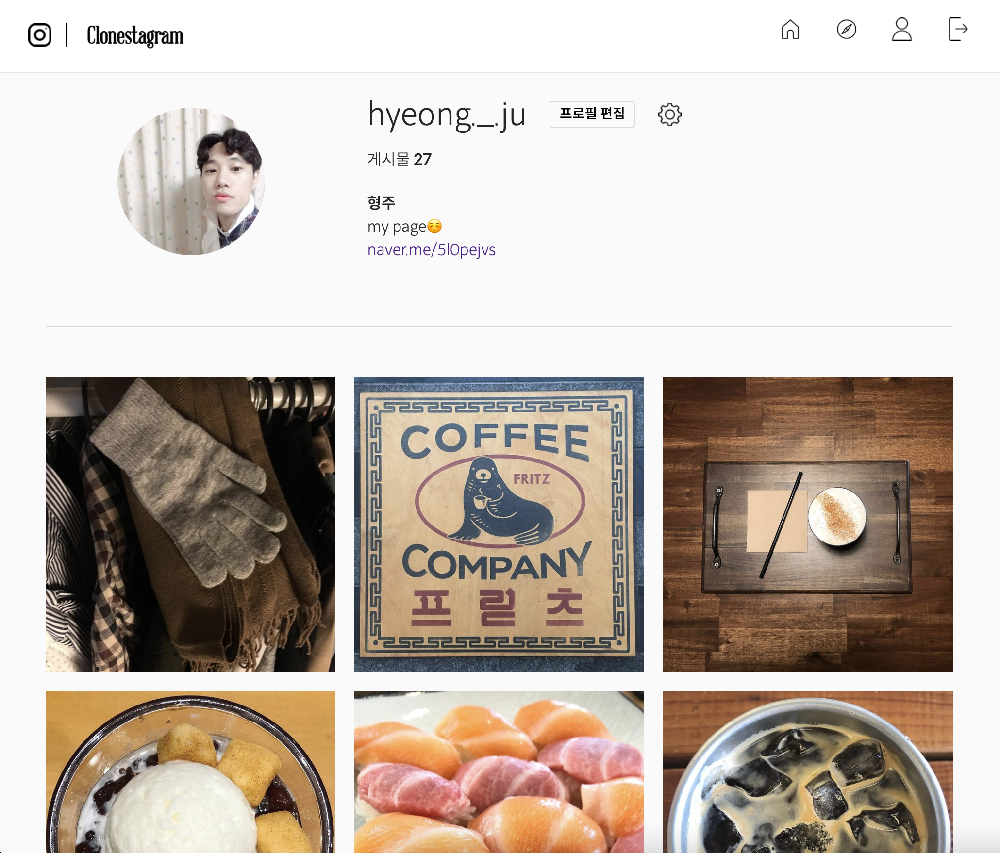

# instagram-clone-django

> 취미로 만든 인스타그램 클론 코딩입니다 :)  

## stack
  - 형상관리 - GIT
  - language - Python 3.X
  - Web F/W - Django
  - Database - sqlite3

## service
  - [X] user
  - [X] post
    - [X] post list
    - [ ] post list paging scroll
    - [X] post detail
    - [ ] post detail reply(regist time)
  - [ ] profile
    - [X] profile list
    - [ ] profile list paging scroll
    - [X] profile detail
    - [ ] profile detail reply(regist time)
  - [ ] follower, following
  - [ ] like, unlike
  - [ ] book mark
  - [ ] comment
  - [ ] search
  - [ ] activity history

## code
  - [ ] jQuery 종속성 제거 리팩토링
